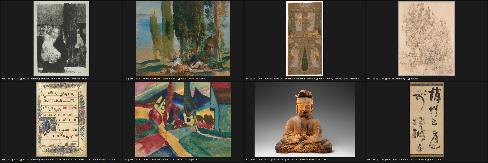

# Image Deep Research

**Image deep research and visual research for Claude Code and Codex.** Find
reference images on open, licensed collections with every URL verified and
every licence kept, render real websites into screenshot contact sheets,
measure a live site's palette and typefaces, and build moodboards - then read
the pictures as pictures.

Most design questions are answered by looking at twenty examples, not by
reading one article about them. This plugin gets those twenty examples in
front of the model in one or two image reads, and holds it to what it
actually saw.



<sub>Real output of `node skills/image-deep-research/scripts/images.mjs "cypress trees" --sources aic,met --n 6 --sheet`, 2026-09-26: the first of two sheets, every URL fetched and verified before it was tiled. All eight works are CC0. Not every hit is a cypress, which is why the skill reads the sheet before it recommends anything.</sub>

```
/plugin marketplace add ridelink0/image-deep-research
/plugin install image-deep-research@image-deep-research
```

Codex and the other routes are under [Install](#install).

It also ships inside [Ultimate Frontend Skills](https://github.com/ridelink0/ultimate-frontend-skills),
which carries this skill as its image research route. If you already have
UFS installed you have this skill: do not install both, or the skill will show
up twice.

## What it does

**Open image collections, no keys.** `images.mjs` searches
[Openverse](https://openverse.org) (Creative Commons and public-domain images
from Flickr, museums and more), [Wikimedia Commons](https://commons.wikimedia.org),
the [Art Institute of Chicago](https://www.artic.edu/open-access) (public-domain
works only) and [the Met](https://www.metmuseum.org/about-the-met/policies-and-documents/open-access)
(Open Access works only). Each result keeps its title, creator, licence,
licence URL and source page. Every image URL is fetched before it is reported,
and one that does not answer with an image is marked as failed and never put
on the moodboard. `--commercial` keeps only licences that allow commercial use
and changes; `--sheet` tiles the verified images into a numbered moodboard;
`--download` saves them.

**Real websites, rendered.** `study.mjs` loads each site in headless Chrome,
Edge or Chromium, screenshots the top and one screen down, and tiles the shots
eight to a contact sheet. It measures what the browser computed: the ground
colours by painted area, the text colours by amount of text, and the heading
and body typefaces with size, weight and line height. A page that answers
with a bot challenge or Access Denied, or renders next to nothing (a
preloader), is reported as a wall with the reason and kept off the sheet
rather than guessed at. Four curated lists come
with it: `editorial`, `object`, `cinema`, `product`.

**A method, not just a search.** The skill runs research in rounds: write the
question so a picture can answer it, gather, read the sheets, search again
with the better words the first round taught you, and stop when a new round
stops changing the answer. The report lists sheet paths, every recommended
image with its verified URL and licence, and one concrete move per reference.

## Install

### Claude Code

```
/plugin marketplace add ridelink0/image-deep-research
/plugin install image-deep-research@image-deep-research
```

or from a terminal:

```bash
claude plugin marketplace add ridelink0/image-deep-research
claude plugin install image-deep-research@image-deep-research
```

### Codex

```bash
codex plugin marketplace add ridelink0/image-deep-research
codex plugin add image-deep-research@image-deep-research
```

Codex reads the same `.claude-plugin/marketplace.json` and the plugin's
`.codex-plugin/plugin.json`.

### Any agent the skills CLI knows

```bash
npx skills add ridelink0/image-deep-research
```

This copies the skill folder, scripts included, into every agent it finds on
the machine. It installs the skill only, not the slash commands.

### Requirements

Node 22 or newer (the scripts use its built-in `fetch` and `WebSocket`; there
are no dependencies to install). Rendering needs Chrome, Edge or Chromium; on
Windows Edge is usually already there. Set `IDR_BROWSER` to the browser
executable if it lives somewhere unusual. The browser always runs headless and
never opens a window. Image search alone needs no browser.

## Use

Ask a question that is better answered by looking:

> What do the first screens of luxury watch sites have in common? Show me.

> Find public-domain reference images of brutalist concrete interiors for a moodboard.

Or start it directly:

| Claude Code | Codex | What it does |
|---|---|---|
| `/image-deep-research:image-deep-research <topic>` (or `/image-deep-research`) | `$image-deep-research:image-deep-research` | The full research loop |
| `/image-deep-research:find-reference-images <subject>` | `$image-deep-research:source-command-find-reference-images` | Search the open collections and build a moodboard |
| `/image-deep-research:website-contact-sheet <urls or list>` | `$image-deep-research:source-command-website-contact-sheet` | Render sites into contact sheets with palette and type |

The scripts also run on their own:

```bash
node skills/image-deep-research/scripts/images.mjs "cypress trees" --sheet --commercial
node skills/image-deep-research/scripts/study.mjs https://stripe.com https://linear.app
node skills/image-deep-research/scripts/study.mjs --list editorial --width 390
```

Output goes to a temporary folder that is printed at the end (`--out <dir>`
to choose one): the sheets as JPEG, the screenshots as PNG, and
`results.json` or `report.json` with everything measured.

## What it cannot do

It cannot see behind a bot wall or a login, and a WebGL site may screenshot as
its preloader; it says so instead of guessing. Unsplash and Pexels need a free
API key, so they are not searched; the skill explains how to use them if you
have one. A licence is reported as the collection states it: check the source
page before shipping an image in a product.

## Development

```bash
npm test            # units, manifests, command rules, CLI errors, and the browser half
npm run test:live   # the four collections, live (not run in CI)
```

CI runs `npm test` on Ubuntu and Windows with a real Chrome and fails if any
test is skipped, so the browser half always runs there.

### Keeping Ultimate Frontend Skills in step

UFS vendors `skills/image-deep-research/` from a tagged release of this repo
with its `scripts/sync-image-research.mjs`, which records the version and a
sha256 of every file in a lock file; a UFS test fails if the bundled copy
drifts from the lock. Change the skill here, tag a release, then sync UFS to
the tag.

## Keywords

image research, deep research, image deep research, visual research, reference
images, design references, moodboard, mood board, contact sheet, website
screenshots, competitor research, colour palette, typography, public domain
images, Creative Commons images, Openverse, Wikimedia Commons, Claude Code
plugin, Claude skill, Codex plugin.

## Credits

- Built by [Gev](https://github.com/ridelink0).
- The skill began as the `visual-research` skill in
  [Ultimate Frontend Skills](https://github.com/ridelink0/ultimate-frontend-skills);
  `scripts/browser.mjs` is vendored from its `scripts/inspect.mjs` (MIT), and
  the curated site lists follow its study lists.
- Image data from [Openverse](https://openverse.org) (WordPress Foundation),
  [Wikimedia Commons](https://commons.wikimedia.org), the
  [Art Institute of Chicago API](https://api.artic.edu/docs/) and
  [The Metropolitan Museum of Art Collection API](https://metmuseum.github.io/).
  Each image keeps its own licence and creator; this project claims none of
  them.

## License

MIT. See [LICENSE](LICENSE).
